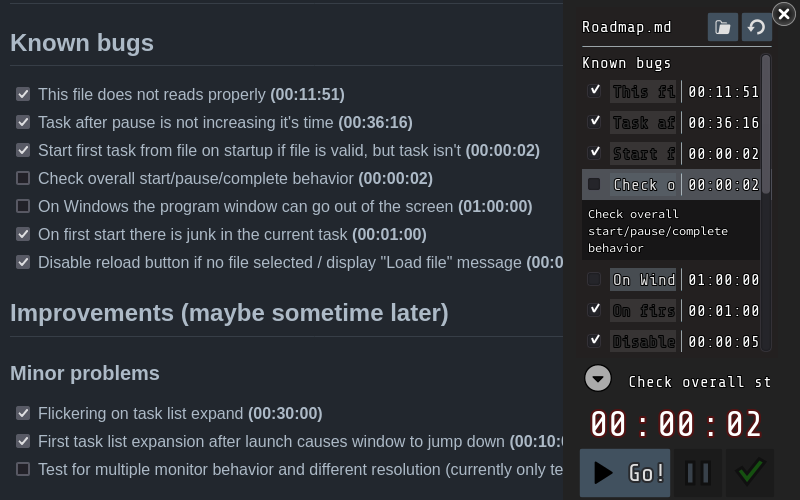

# "Micro" time tracker

(It's not micro, because there is no sane options for now to minimize Godot builds adequately.)

## Embedded task tracking

Why not track all the tasks side by side with the source code? No cloud providers, just you and a couple of Markdown files. 

Need synchronization? - Use git.

Need time tracker? - Well, here it is. 

The "Micro" time tracker parses tasks in your markdown files, recognizing a tiny subset of Markdown. It appends time spent on each task into those same tiles.

## Example

Here is a markdown file [docs-examples/Roadmap.md](docs-examples/Roadmap.md) opened by Microtracker



## Markdown subset syntax

The following is recognized in a Markdown task file. Tasks are from github format.
```
"# "       - task block, any level header in markdown. 
             All the tasks should be in one of the task blocks.
"\n- [ ] " - uncompleted task
"\n- [x] " - completed task
" **(int:int:int)**" - time spend on the task at the end of the task string
```
 Everything else you can use to format the files as you want. Such time tracking is not enforcing anything. You obviously can also edit the time anytime you want. Exact regular expression used are aet the bottom of the page.

 ## Sync

It's supposed to be synced by git along with the main project, so every member should better use different file with tasks, just to avoid merge conflicts. If you trust your cloud provider, like Google Disk or Dropbox, you can sync with it.

#### Pros: 
- You don't depend on cloud service providers.
- You don't leave IDE to check tasks. (Don't get distracted by those browser and web interfaces.)
- You can synchronize task statuses with Git along with your commits.
- You don't lose your task change history if you use Git. 


#### Cons: 
- There is no way to intelligently sync file, that is being currently used to track the time. You are at your own here. The program will track the hash of the last used markdown file and if current file differs, the program instead of saving to the file, will display the warning and prompt you to reload the file. Desyncs can happen when file was changed:
    - by you in some external text editor
    - after git pull
    - after git check out to another branch or commit

- Individual contributions are neither measured, nor time spent on one task by different members is added. You have to add it yourself while resolving merge conflicts. Best solution will be to have individual files or track time outside the git repo being used.

## Tips:
1. You can edit all markdown files with VSCode for example, there are some nice extensions for the github format previews (those checklists).

    - Markdown Preview Enhanced
    - GitHub Markdown Preview
    - Markdown Preview Github Styling
2. You can use folders with files task lists as canban boards. When all task in the file are done, move it to another folder, something like that, I guess.
3. To prevent desync use personal markdown files with task lists, which aren't updated by other users.

## Implementation details
1. The markdown file is changed in the following circumstances:
    - When the task status changed ()
    - Once a second (yeah it's too often, but as a prototype it'll go) - task time is updated
2. User settings are rewritten to settings.json
    - On program exit
    - File selected    
    - Task selected
    - Task list expand / collapse
    - Program window end drag
3. File parsing regular expressions


First file is split in sections
```regex
	"# (.+)[^#]*\n- \\[[ x]\\][^#]*"
```
then every section is searched for tasks headers (here checkbox status extracted)
```regex
	'\n- \\[( |x)\\] (.*)'
```
then the task header (first line with checkbox) is searched for the time
```regex
	'\\*\\*\\(\\d{2,}:\\d{2}:\\d{2}\\)\\*\\*$'
```

## Final notice

It's a prototype. I had something like that in mind for some time to decouple from cloud providers. If this project catches interest I may rewrite it in something more suitable instead of a game engine, like Qt. Or you can do it yourself.
 